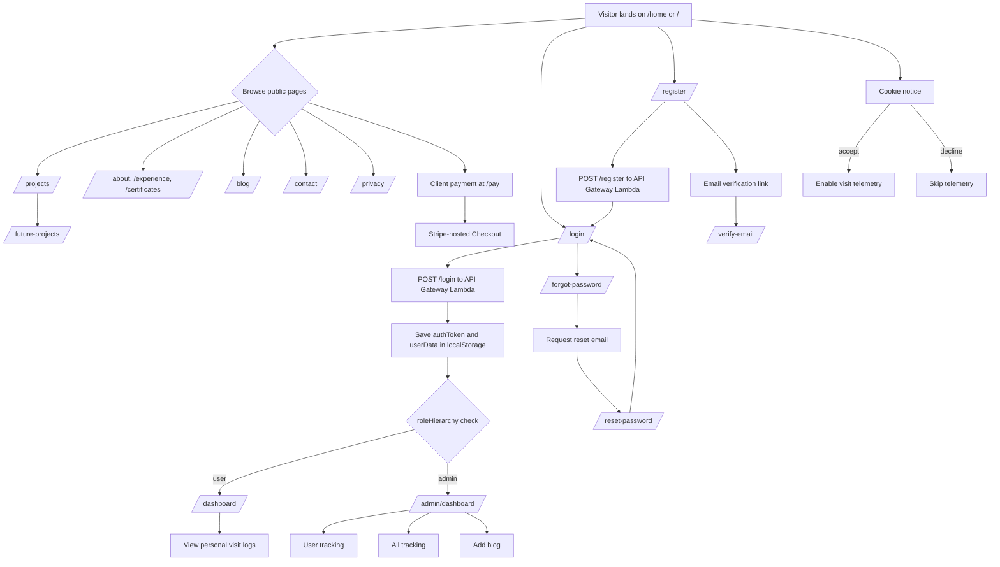

# Nick Hanson Showcase Site

This repository contains the React application for my personal developer showcase. It presents projects, experience, certificates, blog content, contact functionality, and authenticated user/admin views. The application is deployed through Netlify and uses AWS-backed APIs for selected authentication, blog, and visit-tracking features.

## Technology

- React 18 and React Router
- Vite 7
- Tailwind CSS 3, Sass, and PostCSS
- Netlify deployment, SPA routing, and Netlify Forms
- AWS API Gateway, Lambda, DynamoDB, and SES for the custom authentication and related backend workflows
- Optional local Express stub under `backend/`

## Requirements

- Node.js 24
- npm

## Local development

Install the root dependencies:

```text
npm install
```

Start the Vite development server:

```text
npm run dev
```

Create a production build:

```text
npm run build
```

The production output is written to `dist/`. Preview that build locally with:

```text
npm run preview
```

## Deployment and contact form

Netlify runs the production build and publishes `dist/`. Client-side routes use the SPA fallback in `public/_redirects`.

The contact page uses Netlify Forms directly. Root `index.html` contains the static form blueprint required for build-time detection, while `src/pages/Contact.jsx` submits matching fields as a URL-encoded `POST /`. A Netlify honeypot field provides native spam protection without changing the visible form experience.

## Validation and tests

CI performs a clean dependency install and runs the Vite production build on Node 24. There is currently no automated frontend test suite or `npm test` script; test-strategy work is intentionally deferred.

## Authentication overview

The site uses a custom AWS-backed authentication flow rather than Auth0, Firebase, or another hosted identity provider:

1. Registration and login requests are sent to API Gateway endpoints backed by Lambda functions.
2. Password hashing and credential validation occur in the backend workflow; credentials are not stored in the frontend.
3. User records and role information are stored in DynamoDB.
4. The frontend stores the returned authentication token and user data in local storage.
5. `PrivateRoute` enforces the current `user` and `admin` route hierarchy and session validation behavior.
6. Forgot-password, reset, verification, and session-invalidation workflows are implemented through the related AWS services.

### User journey



Role behavior at a glance:

- Visitors can access all public content, the client-payment page, registration, login, and account-recovery routes.
- `/pay` sends clients to Stripe-hosted Checkout; this site does not collect or store card or bank-account details.
- Authenticated users are directed to `/dashboard` and can view their personal visit analytics.
- Administrators are directed to `/admin/dashboard` and can access tracking and blog-publishing tools.
- Failed authentication or insufficient roles redirect to login or deny the protected action.

### Browser authentication state

| Local-storage key | Purpose |
| --- | --- |
| `authToken` | Holds the token used to validate the current session. |
| `userData` | Holds the current user profile, role, and session-version data. |
| `currentUser` | Legacy compatibility key removed during logout when present. |

These values are cleared during logout. Protected routes also validate the session with the backend; local storage alone is not treated as authorization.

### Account recovery and session safety

- Forgot-password and reset flows have been validated end to end.
- Reset tokens are single-use and expire.
- A successful reset increments `tokenVersion`, and `POST /session/validate` rejects stale sessions.
- SES sends reset and password-changed notifications.
- Per-account cooldowns and per-account/per-IP limits protect recovery requests from abuse.

Detailed authentication documentation:

- [Authentication overview](docs/AUTH_OVERVIEW.md)
- [Authentication documentation index](docs/dev/auth/AUTH_DOCS_INDEX.md)
- [Account recovery implementation](docs/dev/auth/ACCOUNT_RECOVERY_IMPLEMENTATION.md)
- [Registration hardening checklist](docs/dev/auth/REGISTRATION_HARDENING_CHECKLIST.md)
- [Lambda source and deployment workflow](lambda-functions/README.md)

## Repository notes

- Public static data and assets live under `public/`.
- Active Lambda source lives under `lambda-functions/`; generated dependency directories are not tracked.
- The optional `backend/` project is a minimal local Express stub and is not the production application backend.
- Local credentials and protected environment files must not be committed.

## Licensing

This repository is publicly visible for portfolio and code-review purposes. No
general license to use, copy, modify, or redistribute its original source code
or assets is granted unless explicitly stated otherwise. Third-party names,
trademarks, logos, badges, and other materials remain the property of their
respective owners.
