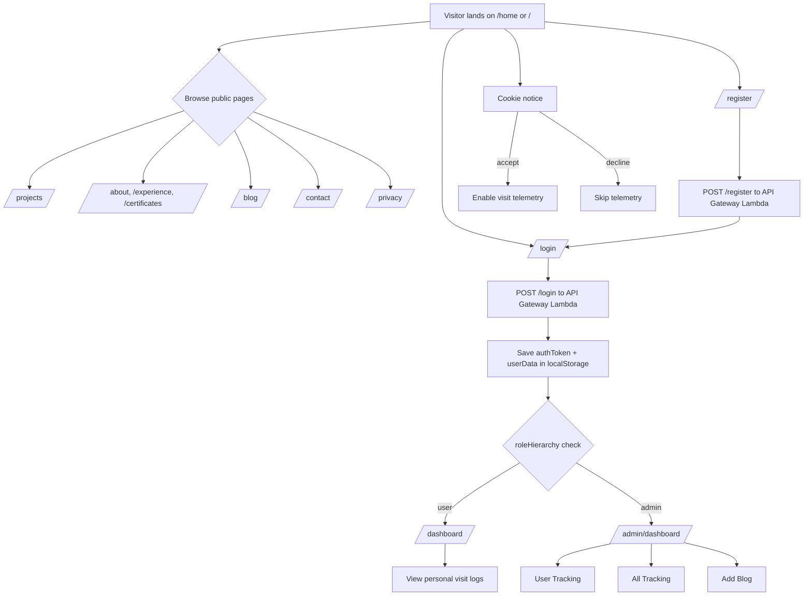

🔐 Custom Authentication Flow
This project uses a custom-built authentication system, not a third-party provider like Auth0 or Firebase.

✅ Summary
Auth credentials are stored in DynamoDB

Passwords are hashed with bcrypt via a Lambda backend

Users are authenticated through custom REST API endpoints

Tokens are stored in localStorage

Role-based protection is enforced via a custom <PrivateRoute /> component

🔁 Full Auth Flow
🔹 Registration (/register)
User submits username, email, password, and confirmPassword

Frontend sends a POST to:
POST https://<api-gateway-endpoint>/register

Lambda function:

Hashes the password with bcrypt

Stores user in DynamoDB with default role: "user"

On success: user is redirected to login

🔹 Login (/login)
User submits username + password

Frontend sends a POST to:
POST https://<api-gateway-endpoint>/login

Lambda function:

Looks up user by username

Compares password using bcrypt

Returns:

{
"token": "<jwt or mock token>",
"user": {
"username": "nick",
"email": "nick@example.com",
"role": "admin"
}
}
Frontend stores:

authToken → in localStorage

userData → in localStorage

User is redirected to:

/admin/dashboard if role is "admin"

/dashboard if role is "user"

🔐 Role-Based Route Protection
The custom <PrivateRoute /> component checks:

If the user is logged in (via token in localStorage)

If their role is sufficient ("admin" or "user")

If not:

User is redirected to /login

Or shown a "You don’t have access" alert

💾 LocalStorage Keys Used
Key Description
authToken Used to verify login session
userData Stores user info including role
currentUser (optional) used in some contexts

These are cleared automatically on logout.

🚀 Tech Involved
Backend: AWS Lambda, API Gateway, DynamoDB, bcrypt

Frontend: React, Axios, React Router

Security: Basic token storage (can be extended with real JWT validation)

🧭 User Journey (Visitor → User → Admin)

Role-based route behavior (at a glance):

- Visitor (guest): can access all public pages, login, and registration.
- User: gets redirected to /dashboard after login and can view personal visit analytics.
- Admin: gets redirected to /admin/dashboard after login and can access tracking tools and blog publishing.
